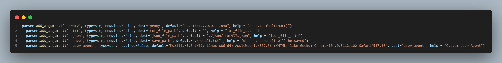

### file_parser.py

> 该文件目前支持解析fofa下载的json文件，以及含有固定格式内容的txt文件。主要用于资产过滤
>
> example：txt文件内容格式

```
127.0.0.1:8080
192.168.14.45:7777
114.114.114.114:4567
...
```

##### 运行改python程序可以自动解析指定文件中的ip:port

##### 会对获取到的ip:port进行存活探测，无法访问的地址端口将被抛弃，并在当前目录生成一个result.txt的文件用于保存有效ip:port



#### 参数

```
-h  //获取帮助，显示参数及使用
--proxy  //默认使用127.0.0.1:7890作为代理，可以自行设置
--txt  //需要解析的txt文件路径
--json  //需要解析的json文件路径
--save  //指定结果的保存位置
--user-agent  //默认使用Mozilla/5.0 (X11; Linux x86_64) AppleWebKit/537.36 (KHTML, like Gecko) Chrome/104.0.5112.102 Safari/537.36
```

